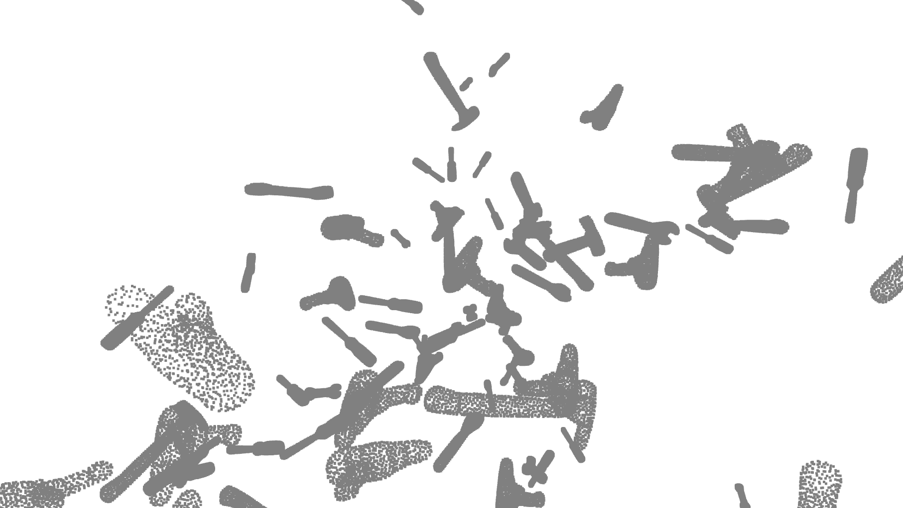

# PCD_to_Position_Estimation

The tool for processing point clouds for object classification and 6D pose estimation.

## Overview

Input data for the tool is the set of 3D models of the objects and the corresponding object names. First step is creating the dataset of the point clouds sampled from the provided models. The dataset is saved as `.npz` file and consists of the point clouds, integer labels and transformations in the form of the 4x4 matrices. 

The constructed dataset is used to train the neural network for label an position prediction. The network consists of the PointNet++ based backbone and the MLP classification and regression heads. In order to provide the network with the information about position in the global reference frame the absolute coordinates of the points are added into the embedding vector at the last SetAbstraction layer. 

### Current state and plans

Final goal is to predict the label and pose from the partial point cloud obtained from the RGBD camera. 

Currently we are testing the networks at the simpler task of predictions from the point cloud sampled from the entire object. The task is divided into three subtasks: label, 3d translation and rotation. For each subtask we have an individual model and a training loop to test various model enhancements and loss functions. 

The current testing dataset consists of the 100000 point clouds sampled from the five 3D models of the tools. The point clouds are uniformly distributed in the cone with angle of 60 degrees which corresponds to the standard camera field of view model.  

